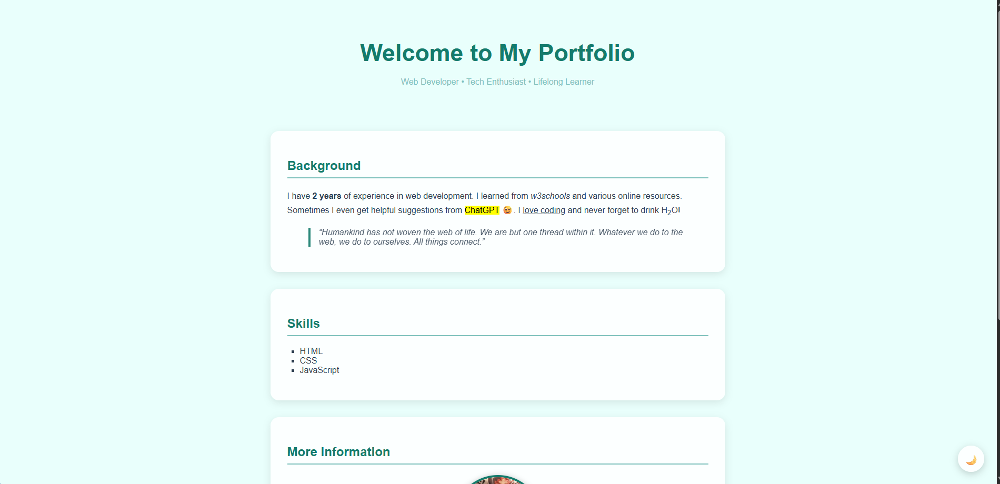

# 🌐 My Portfolio

Welcome to my personal portfolio website!  
This project is built entirely with **HTML** and **inline CSS styling**, keeping it simple, clean, and lightweight, while showcasing my work experience and technical expertise.

---

## 🚀 Live Demo
Check it out here:  
👉 [https://tomyamgtx.github.io/html-portfolio/](https://tomyamgtx.github.io/html-portfolio/)

---

## 💡 Features
- One-page portfolio with **sticky top navigation**  
- Clean black & white design for readability (works in light/dark mode)  
- Includes sections: **Background**, **Tools & Expertise**, **Achievements**, **Leadership**, and **Connect**  
- Responsive **grid layout** for skills, achievements, and leadership  
- Avatar image and social media links  
- Theme toggle button for light/dark mode  
- Clickable email icon in the footer for easy contact  

---

## 🛠️ Technologies Used
- **HTML5**  
- **CSS3** (inline styling and simple grid/flex layouts)  
- **JavaScript** for theme toggle and smooth scrolling  

---

## 📚 Background
- IT graduate with professional experience **since 2022**, primarily **remote work**  
- Specializes in **Flutter** for cross-platform web and mobile apps  
- Experienced in **Firebase** backend integration and hosting with **Cloudflare, Vercel, and GitHub Pages**  
- Focused on building responsive, maintainable, and modern applications  

---

## 🛠️ Tools & Expertise
- **Flutter & Dart** – Cross-platform apps with responsive design and scalable architecture  
- **Backend & Hosting** – Cloudflare, Firebase, GitHub Pages, Vercel  
- **Payment Integration** – Stripe for one-time and subscription payments  
- **SEO & Analytics** – Next.js, Google Search Console, Bing Webmaster Tools  
- **Firebase Services** – Authentication, Firestore, Storage, Push notifications  
- **Dev Tools** – Git, GitHub, VS Code, Postman, Figma  

---

## 🏆 Achievements
- Published multiple apps on **Play Store & App Store**  
- Integrated high-impact features: drag-to-reorder, quantity selection, offline mode, and notifications  
- Built responsive portfolio site with **light/dark toggle**  
- Mentored interns and coordinated projects to ensure timely delivery  

---

## 👨‍💼 Leadership
- Managed interns across multiple projects  
- Coordinated project tasks and deadlines  
- Guided teams to implement client requirements efficiently  

---

## 📱 Connect
- 🎵 [Threads](https://www.threads.com/@kimimdnoor99)  
- 💻 [GitHub](https://github.com/tomyamGTX)  
- 🔗 [LinkedIn](https://www.linkedin.com/in/hakimimdnoor/)  
- ✉️ Clickable email icon in footer for direct contact  

---

## 📸 Preview

---

## 👤 Author
**Hachimy99**  
🎥 [TikTok](https://www.tiktok.com/@hachimy99)

---

## 📜 License
This project is open-source and available under the [MIT License](LICENSE).
